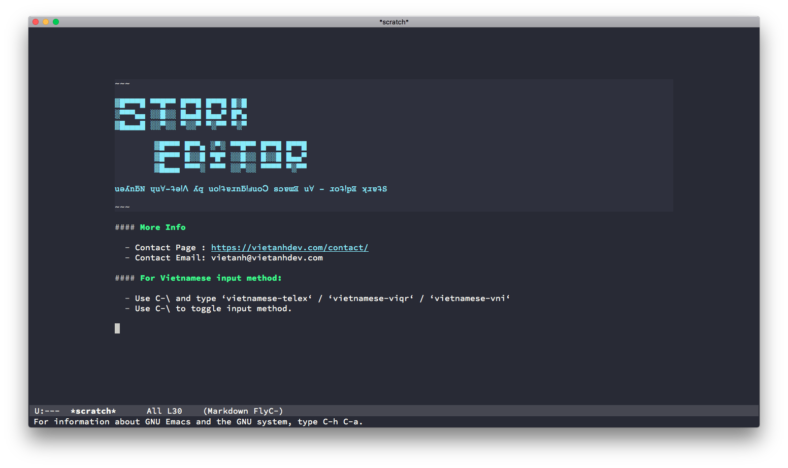
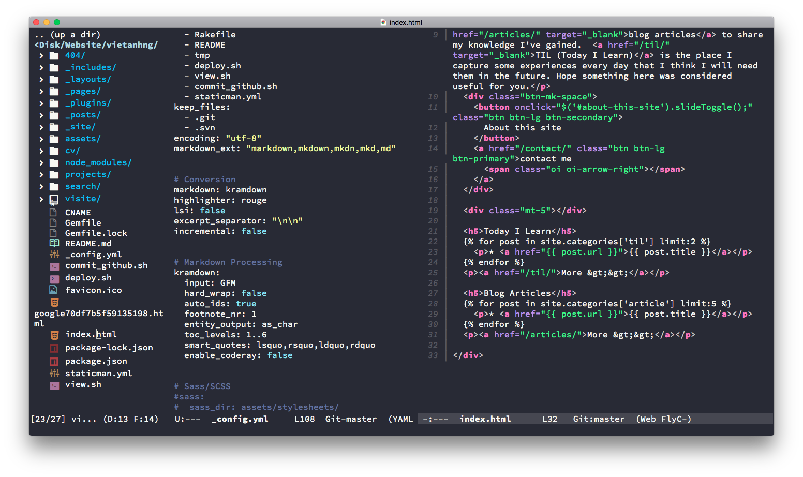

# Stark Editor
This is a new configuration for Emacs focusing on light weight and highly customizable structure.

## Quick Install Guide

# Step 1: Clone Git repository

Open Terminal, type:

~~~ bash
rm -rf ~/.emacs.d
rm ~/.emacs
git clone https://github.com/vietanhdev/S-Editor.git ~/.emacs.d
~~~

For those who don't have git bash on computer:

~~~bash
rm -rf ~/.emacs.d
rm ~/.emacs
wget https://github.com/vietanhdev/S-Editor/archive/master.zip -O emacsd.zip
unzip emacsd.zip
cp -R S-Editor-master/* ~/.emacs.d/
~~~

# Step 2: Open Emacs and wait for first-time installation

This step will download and install all the packages and fonts automatically for you.

It often takes some minutes to be completed. Please be partient!

# Step 3: Restart Emacs and enjoy!

You can edit some initial settings in `~/.emacs.d/init-settings.el`.

If you have a question or need a hand in setting up this configuration, feel free to contact me:

[vietanhdev.com - contact page](https://vietanhdev.com/contact/).

## For Vietnamese input method:

- Use C-\ and type ‘vietnamese-telex‘ / ‘vietnamese-viqr‘ / ‘vietnamese-vni‘ .
- Use C-\ to toggle input method.
